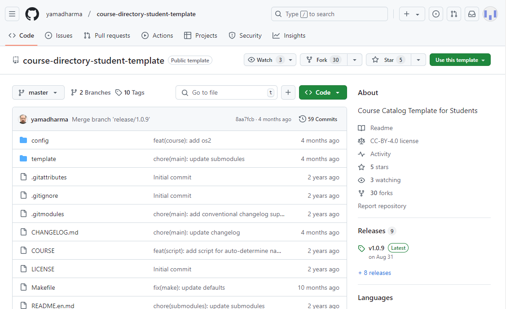
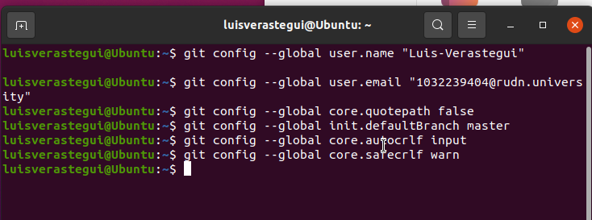
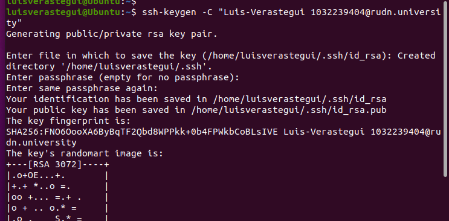
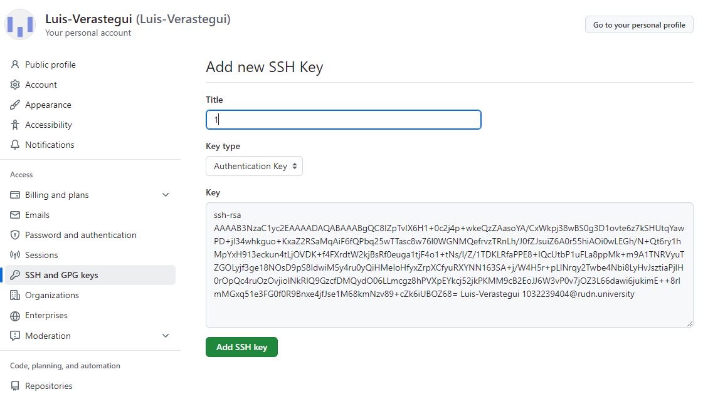
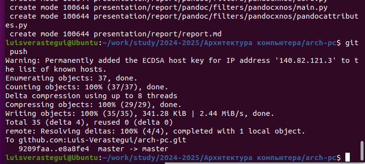

---
## Front matter
title: "Отчёт по лабораторной работе 2"
subtitle: "Архитектура компьютеров"
author: "Верастеги Котера Луис Элвис "

## Generic otions
lang: ru-RU
toc-title: "Содержание"

## Bibliography
bibliography: bib/cite.bib
csl: pandoc/csl/gost-r-7-0-5-2008-numeric.csl

## Pdf output format
toc: true # Table of contents
toc-depth: 2
lof: true # List of figures
lot: true # List of tables
fontsize: 12pt
linestretch: 1.5
papersize: a4
documentclass: scrreprt
## I18n polyglossia
polyglossia-lang:
  name: russian
  options:
	- spelling=modern
	- babelshorthands=true
polyglossia-otherlangs:
  name: english
## I18n babel
babel-lang: russian
babel-otherlangs: english
## Fonts
mainfont: PT Serif
romanfont: PT Serif
sansfont: PT Sans
monofont: PT Mono
mainfontoptions: Ligatures=TeX
romanfontoptions: Ligatures=TeX
sansfontoptions: Ligatures=TeX,Scale=MatchLowercase
monofontoptions: Scale=MatchLowercase,Scale=0.9
## Biblatex
biblatex: true
biblio-style: "gost-numeric"
biblatexoptions:
  - parentracker=true
  - backend=biber
  - hyperref=auto
  - language=auto
  - autolang=other*
  - citestyle=gost-numeric
## Pandoc-crossref LaTeX customization
figureTitle: "Рис."
tableTitle: "Таблица"
listingTitle: "Листинг"
lofTitle: "Список иллюстраций"
lotTitle: "Список таблиц"
lolTitle: "Листинги"
## Misc options
indent: true
header-includes:
  - \usepackage{indentfirst}
  - \usepackage{float} # keep figures where there are in the text
  - \floatplacement{figure}{H} # keep figures where there are in the text
---

# Цель работы

Целью работы является изучить идеологию и применение средств контроля версий. Приобрести практические навыки по работе с системой git.

# Выполнение лабораторной работы

## Подготовка GitHub репозитория

Регистрирую учетную запись на GitHub
Приступаю к созданию репозитория на основе шаблона.
(рис. [-@fig:001], [-@fig:002], [-@fig:003])

{ #fig:001 width=70%, height=70% }

{ #fig:002 width=70%, height=70% }

{ #fig:003 width=70%, height=70% }

Теперь подключимся к репозиторию из системы линукс.
Для этого задаем параметры. (рис. [-@fig:004])

{ #fig:004 width=70%, height=70% }

SSH ключ нужен для авторизации пользователя. Создаем его (рис. [-@fig:005])

{ #fig:005 width=70%, height=70% }

Теперь данные ключа нужно добавить в профиль на гитхабе. Тогда гитхаб будет узнавать нас по ключу.
 (рис. [-@fig:006], [-@fig:007])

{ #fig:006 width=70%, height=70% }

{ #fig:007 width=70%, height=70% }

Создаем папку на компьютере и клонируем 
в нее содержимое репозитория, т е шаблон.(рис. [-@fig:008]])

{ #fig:008 width=70%, height=70% }

Оформили курс по шаблону и загрузили в сетевой репозиторий
(рис. [-@fig:009], [-@fig:010])

{ #fig:009 width=70%, height=70% }

{ #fig:010 width=70%, height=70% }

Также загрузили в сетевой репозиторий отчеты по сделанным работам (рис. [-@fig:011])

{ #fig:011 width=70%, height=70% }

# Выводы

При выполнении данной лабораторной работы я изучил идеологию и применение 
средств контроля версий, а также приобрел практические навыки по работе с системой git.

В ходе выполнения работы изучили работу с GitHub.